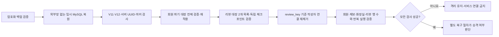

# 리뷰 작성자 연결 해제 복원 보호 — 개발 4주차(2026-09-07~09-13)

2026-09-12 배포 전 후보. 이 문서는 운영 실행 승인이나 데이터 삭제 승인이 아니다.

## 범위

리뷰 작성자가 휴지통에서 `작성자 정보 지우기`를 확정하면 리뷰 UUID만 암호화 대장에 먼저 기록한다. SQL에서는 해당 리뷰의 작성자 연결과 작성 요청 연결만 제거한다. 리뷰 행·자유글·평가·화장지·대기시간·화장실·회원·제보·감사·운영 로그는 이 단계의 삭제 대상이 아니다.

과거 DB 백업을 격리 복원할 때 회원 파기 대장을 재적용한 뒤 리뷰 대장을 재적용한다. 리뷰의 숫자 ID가 아니라 V12의 변경 불가능한 `review_key` UUID를 사용하므로 ID 재사용으로 다른 리뷰를 바꾸지 않는다. 일부 단계가 실패하면 DB를 서비스에 연결하지 않고 같은 입력으로 다시 실행한다. 재실행은 이미 익명인 리뷰를 다시 변경하지 않는다.

## 실행 경계

- `AccountErasureRestoreCli`와 `ReviewUnlinkRestoreCli`는 스케줄러나 HTTP API가 아닌 독립 오프라인 도구다. 기본 실행은 dry-run이다.
- 복원 DB는 내부 Docker 네트워크의 고정 시험 포트만 허용하고 호스트 포트를 공개하지 않는다. binlog와 event scheduler를 끄고, 무작위 마커·서버 UUID·단일 네트워크를 대조한다.
- V12 리뷰 테이블이 있는 백업은 `REVIEW_RESTORE_REQUIRED=true`와 대장 기대 건수를 명시하지 않으면 복원 셸이 중단된다. V12 이전 백업은 기존 회원 파기 복원만 허용하며, 리뷰 단계를 조용히 건너뛰거나 부분 V12를 받아들이지 않는다.
- 리뷰 대장은 회원 파기 대장과 다른 절대 경로·store ID를 요구한다. 같은 경로나 상하위 경로면 중단한다.
- 독립 체크포인트는 `operations-checkpoints`의 전용 orphan 브랜치 `review-anonymization-v1`만 읽고 갱신한다. 회원 파기 main/history나 다른 브랜치 쓰기는 거부한다.
- 빈 대장이나 유실을 자동으로 0건으로 간주하지 않는다. 전용 브랜치의 genesis, 로컬 marker/lock, 동일 DB epoch, 기대 건수가 모두 일치해야 한다.
- 출력은 단계명과 집계만 남기며 UUID·키·토큰·DB 비밀번호·본문을 출력하지 않는다.

## 운영 배포 전 1회 준비

1. 회원 파기 대장과 분리된 Linux 로컬 디렉터리·marker·lock과 새 store ID를 만든다.
2. 독립 저장소의 전용 orphan 브랜치에 같은 DB epoch, realm `review-anonymization`, 0건 inventory로 서명되지 않은 집계 genesis를 만든다.
3. 현재 서버에 별도로 보관한 키로 두 목록과 genesis를 읽는 사전 검사를 통과시킨다.
4. 가상 V12 백업을 격리 복원해 dry-run → 회원 파기 적용 → 리뷰 연결 해제 적용 → 반복 적용 0건 → 행 수 보존을 확인한다.
5. 위 결과와 정확한 이미지/도구 해시를 남긴 뒤에만 API의 리뷰 작성자 연결 해제 플래그를 활성화한다.

실제 branch·디렉터리·store ID 생성, 서버 설치, 운영 백업 복원 시험은 별도 운영 승인 전에는 하지 않는다.

## 24시간 제한 행 정리

`toilet_review_toilet_guard`는 리뷰 본문이 아니라 시설별 24시간 작성 제한 메타데이터다. 신규 작성 때 해당 사용자의 만료 행을 이미 정리하고, 장기간 미접속 사용자의 행은 API의 기본 OFF 정리 작업이 5분마다 최대 1,000개만 조건부 삭제한다. 단일 API 서버가 리뷰 트랜잭션과 같은 DB 규칙을 소유하므로 이 제한 행 정리는 API에서 실행한다. 회원정보 3개월 파기 배치나 전체 로그·제보·감사 보관 정책으로 범위를 확대하지 않는다.
