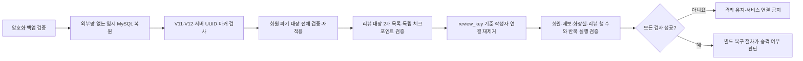

# 리뷰 작성자 연결 해제 대장·복원 보호 — 개발 4주차(2026-09-07~09-13)

2026-09-12 배포 전 후보. 이 문서는 운영 실행 승인이나 데이터 삭제 승인이 아니다.

## 범위

리뷰 작성자가 휴지통에서 `작성자 정보 지우기`를 확정하면 리뷰 UUID만 암호화 대장에 먼저 기록한다. SQL에서는 해당 리뷰의 작성자 연결과 작성 요청 연결만 제거한다. 리뷰 행·자유글·평가·화장지·대기시간·화장실·회원·제보·감사·운영 로그는 이 단계의 삭제 대상이 아니다.

과거 DB 백업을 격리 복원할 때 회원 파기 대장을 재적용한 뒤 리뷰 대장을 재적용한다. 리뷰의 숫자 ID가 아니라 V12의 변경 불가능한 `review_key` UUID를 사용하므로 ID 재사용으로 다른 리뷰를 바꾸지 않는다. 일부 단계가 실패하면 DB를 서비스에 연결하지 않고 같은 입력으로 다시 실행한다. 재실행은 이미 익명인 리뷰를 다시 변경하지 않는다.

```mermaid
flowchart LR
  A[암호화 백업 검증] --> B[외부망 없는 임시 MySQL 복원]
  B --> C[V11·V12·서버 UUID·마커 검사]
  C --> D[회원 파기 대장 전체 검증·재적용]
  D --> E[리뷰 대장 2개 목록·독립 체크포인트 검증]
  E --> F[review_key 기준 작성자 연결 재제거]
  F --> G[회원·제보·화장실·리뷰 행 수와 반복 실행 검증]
  G --> H{모든 검사 성공?}
  H -->|아니요| I[격리 유지·서비스 연결 금지]
  H -->|예| J[별도 복구 절차가 승격 여부 판단]
```

## 실행 경계

- `AccountErasureRestoreCli`와 `ReviewUnlinkRestoreCli`는 스케줄러나 HTTP API가 아닌 독립 오프라인 도구다. 기본 실행은 dry-run이다.
- 복원 DB는 내부 Docker 네트워크의 고정 시험 포트만 허용하고 호스트 포트를 공개하지 않는다. binlog와 event scheduler를 끄고, 무작위 마커·서버 UUID·단일 네트워크를 대조한다.
- V12 리뷰 테이블이 있는 백업은 `REVIEW_RESTORE_REQUIRED=true`와 대장 기대 건수를 명시하지 않으면 복원 셸이 중단된다. V12 이전 백업은 기존 회원 파기 복원만 허용하며, 리뷰 단계를 조용히 건너뛰거나 부분 V12를 받아들이지 않는다.
- 리뷰 대장은 회원 파기 대장과 다른 절대 경로·store ID를 요구한다. 같은 경로나 상하위 경로면 중단한다.
- 독립 체크포인트는 `operations-checkpoints`의 전용 orphan 브랜치 `review-anonymization-v1`만 읽고 갱신한다. 회원 파기 main/history나 다른 브랜치 쓰기는 거부한다.
- 빈 대장이나 유실을 자동으로 0건으로 간주하지 않는다. 전용 브랜치의 genesis, 로컬 marker/lock, 동일 DB epoch, 기대 건수가 모두 일치해야 한다.
- 출력은 단계명과 집계만 남기며 UUID·키·토큰·DB 비밀번호·본문을 출력하지 않는다.

## 운영 배포 전 1회 준비

1. 회원 파기 대장과 분리된 Linux 로컬 디렉터리·marker·lock과 새 store ID를 만든다.
2. 독립 저장소의 전용 orphan 브랜치에 같은 DB epoch, realm `review-anonymization`, 0건 inventory로 서명되지 않은 집계 genesis를 만든다.
3. `ReviewUnlinkLedgerPreflightCli --read-only`로 두 목록과 genesis를 읽는 사전 검사를 통과시킨다. 이 명령은 DB·Redis에 연결하거나 파일·checkpoint를 쓰지 않으며 성공해도 활성화를 허용하지 않는다.
4. GitHub Actions의 일회용 MySQL 8에서 가상 V12 백업을 복원해 dry-run → 회원 파기 적용 → 리뷰 연결 해제 적용 → 반복 적용 0건 → 행 수 보존을 확인한다. 운영 미니 PC에서는 이 복원 컨테이너를 실행하지 않는다.
5. 위 결과와 정확한 이미지/도구 해시를 남긴 뒤에만 API의 리뷰 작성자 연결 해제 플래그를 활성화한다.

실제 branch·디렉터리·store ID 생성, 서버 설치, 운영 백업 복원 시험은 별도 운영 승인 전에는 하지 않는다. 운영 미니 PC에서는 읽기 전용 대장/체크포인트 사전검사만 허용한다. 실제 백업 복원 훈련은 별도 장비 또는 사전 공지한 유지보수 시간으로 분리한다.

## 24시간 제한 행 정리

`toilet_review_toilet_guard`는 리뷰 본문이 아니라 시설별 24시간 작성 제한 메타데이터다. 신규 작성 때 해당 사용자의 만료 행을 이미 정리하고, 장기간 미접속 사용자의 행은 API의 기본 OFF 정리 작업이 5분마다 최대 1,000개만 조건부 삭제한다. 단일 API 서버가 리뷰 트랜잭션과 같은 DB 규칙을 소유하므로 이 제한 행 정리는 API에서 실행한다. 회원정보 3개월 파기 배치나 전체 로그·제보·감사 보관 정책으로 범위를 확대하지 않는다.

## 성장 보상 도입 시 복원 도구 갱신

- **V40 적용 전 새 복원 도구 묶음을 먼저 검증·설치해야 한다.** API만 갱신하고 기존 복원 실행기를 유지하면 과거 백업에서 익명 리뷰와 성장 보상 원천이 다시 연결될 수 있다. 이 작업의 운영 설치·배포는 아직 수행하지 않았다.
- 공용 `account`, `review`, `growth` 패키지는 API와 배치가 같은 소스를 사용한다. `scripts/verify-account-erasure-contract.ps1 -ApiRepository <API 저장소>`로 파일 집합과 내용을 대조한 뒤 `installErasureTools`로 전체 클래스와 의존성을 패키징한다.
- 기존 배치 전용 보관 종료 도구 14개와 `FileErasureObjectStore`의 package-private 삭제 보조 메서드는 검사 스크립트에 명시된 예외다. 해당 확장은 보존하고 나머지 공용 본문을 엄격히 대조한다. 새 `review`·`growth` 패키지에는 비교 예외가 없다.
- 새 묶음의 `ReviewUnlinkRestoreCli --capabilities`는 DB·대장에 접근하지 않고 `review-unlink-restore growth-v1`을 출력한다. 복원 검증 스크립트는 V40 백업에서 이 응답을 확인하고, 구형 실행기나 일부만 존재하는 V40 스키마를 거부한다.
- 리뷰 연결 제거와 같은 트랜잭션에서 남은 유효 기여에 따라 보상을 정정하고 원본 리뷰·시설 연결을 제거한다. 이미 익명화된 리뷰나 백업에 없는 리뷰 키도 남은 보상 증거 정리 대상이며, 익명 리뷰의 작성자를 복원하지 않는다.
- V40 테이블이 전혀 없는 구형 백업은 기존 방식으로 처리한다. 회원 최종 삭제는 개인 성장 요약·보상·경험치 원장·리뷰 증거를 외래 키 삭제로 함께 제거한다. 복구 동의 보관 기간에는 같은 회원의 성장 기록을 유지한다.

### 독립 도구 출시와 운영 연결 확인

1. 공용 소스 계약과 격리 복원 테스트가 통과한 변경을 검토·병합한다. `restore-tools-build.yml`은 `main`의 정확한 SHA와 `RESTORE_TOOLS_BUILD_APPROVED=true`, `RESTORE_TOOLS_BUILD_APPROVED_SHA`가 일치할 때만 실행한다.
2. 워크플로는 전체 테스트, `installErasureTools`, 안전한 기능 확인 후 `restore-tools-<SHA>` artifact를 만든다. 압축 파일과 SHA-256, 파일별 manifest가 포함된다. 운영 비밀값을 사용하지 않으며 이미지·서버·DB·대장을 변경하지 않는다.
3. 다운로드한 압축 파일과 각 파일 해시를 검증하고 기존과 다른 버전 디렉터리에 설치한다. 기존 복원 라이브러리와 실행기는 보존하며 새 디렉터리의 `lib/*`에서 기능 응답을 직접 확인한다. 배치 앱 이미지를 갱신하지 않아도 이 독립 도구를 설치할 수 있다.
4. **설치만으로 완료되지 않는다.** 운영 복원 실행기가 실제 새 경로를 호출하는지 확인하고, 계정 파기 재적용 뒤 리뷰 대장 재적용과 성장 원천 정리를 함께 수행하게 연결한다. 계정 재적용만 수행하는 기존 검증 결과를 리뷰·성장 복원 성공으로 취급하지 않는다.
5. 전역 유지보수 잠금·고정 백업 해시·동일 DB 세대·독립 체크포인트 조건 아래 승인된 격리 복원 검증을 실행한다. V40 전체/구형 백업, 부분 스키마 거부, 두 번 적용해도 추가 변경 없음, 내용 보존을 확인한다. 성공 증거를 확보한 뒤 API 스키마 적용·성장 기능 활성화·소급 지급 순서를 진행한다.

리뷰 대장 검증의 `--snapshot`은 `REVIEW_UNLINK_PREFLIGHT_READONLY=approved`에서만 허용하며 DB에 연결하지 않는다. 검증된 건수·체크포인트 해시·목록 해시만 반환하고 원본 리뷰 키나 회원 정보는 내보내지 않는다. 운영 연결 실행기는 리뷰 대장 작성과 같은 advisory lock을 같은 DB 세션에서 유지한 채 snapshot → dry-run → 적용 → 재적용 → snapshot 일치를 검사한다. 비활성 event scheduler의 `OFF`와 `DISABLED`는 모두 허용하지만 `ON`은 거부한다. 성장 스키마가 있다면 요약·경험치 원장·활성 보상 합계, 원천 없는 활성 보상, 익명 리뷰에 남은 원천 증거도 별도로 검사한다.

2026-10-04 운영 읽기 확인에서는 주 복원 실행기가 계정 전용 구형 클래스패스를 사용했다. 해당 실행 경로 갱신은 V40 출시의 선행 조건이며, 현재 문서의 빌드·단위 검증으로 운영 연결이나 복원 완료를 대신하지 않는다. V40 이후 기능 플래그를 끄더라도 익명화된 리뷰의 성장 원천 정리는 계속 필요하므로 새 복원 도구를 구형으로 되돌리지 않는다.
